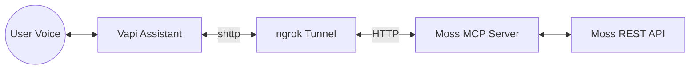

# Building a Voice-Native Semantic Search: Moss MCP + Vapi

In the rapidly evolving landscape of AI agents, the ability to **act** and **know** simultaneously is the holy grail. While LLMs provide the "reasoning," they often lack the "knowledge" of specific datasets and the "voice" to interact with users in real-time.

In this blog, we explore how to bridge this gap using the **Model Context Protocol (MCP)**, **Moss Semantic Search**, and **Vapi's Voice AI**.

---

## 🛠️ The Tech Stack

### 1. Moss MCP Server

[Moss](https://usemoss.dev) is a high-performance semantic search engine optimized for sub-10ms performance. By wrapping Moss in an **MCP Server**, we turn a REST-based database into a standardized set of "tools" that any AI assistant (like Claude, ChatGPT, or Vapi) can discover and use.

### 2. Vapi (Voice AI)

[Vapi](https://vapi.ai) is the leading platform for building real-time voice agents. It handles the complexities of latency, turn-taking, and speech-to-text (STT) / text-to-speech (TTS), allowing developers to focus on the assistant's logic.

### 3. Streamable HTTP (shttp)

The "Glue." While MCP initially focused on `stdio` (local) and `SSE` (web), **Streamable HTTP** has emerged as the most robust transport for real-time integrations. It simplifies the connection into a single, bidirectional HTTP/2 stream, making it significantly more reliable for voice-latency requirements than traditional polling or complex SSE handshakes.

---

## 🏗️ The Architecture

The architecture follows a "Plug-and-Play" model:

1.  **Moss MCP Server**: Runs locally or on a server, exposing search tools.
2.  **ngrok Tunnel**: Provides a secure URL to bypass firewalls and local-host limitations.
3.  **Vapi Discovery**: Vapi connects to the ngrok URL via `shttp`, automatically discovering the search tools without manual configuration.

---

## 💡 Key Technical Insights

### Why shttp over SSE?

During development, we found that traditional **Server-Sent Events (SSE)** often required complex multi-step handshakes (`GET` to open the stream, `POST` to send messages). Vapi follows very complex and specific json rpc format for sse which is not standard and hard to implement due to lack of proper error handling and SSE via vapi has been deprecated giving rise to shttp.

### Bypassing ngrok Barriers

A common pitfall when connecting voice platforms to local servers is the ngrok "browser warning" screen. By injecting the `ngrok-skip-browser-warning: true` header into Vapi's tool configuration, we ensure the "discovery bot" can see the JSON-RPC endpoints directly.

---

## 🚀 Real-World Impact

Imagine a voice assistant for a law firm. Using this stack:

- **Client**: "Tell me about our recent findings on the Smith vs. Johnson case."
- **Assistant (Vapi)**: Detects the need for knowledge → Calls `query_index` on the **Moss MCP** server → Receives relevant case summaries → Speaks the answer back in natural, low-latency voice.

This isn't just a chatbot; it's a **Voice-Native Knowledge Assistant**.

---

## 📖 Get Started

Want to build this yourself?

1. Clone the [Moss MCP Repository](https://github.com/CoderOMaster/moss-mcp).
2. Install Ngrok and run `ngrok http 8000`.
3. Connect your data and start talking to your indexes.
